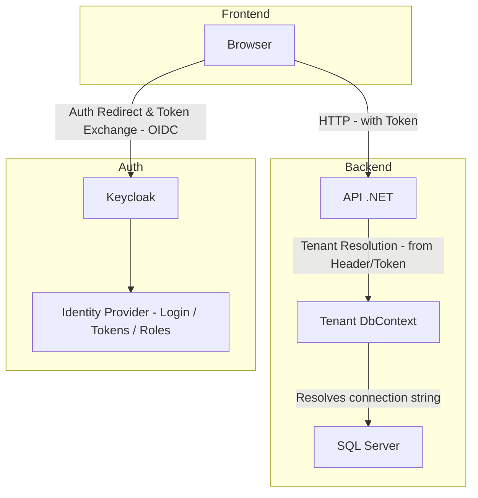

# Aspire Multi-Tenant Starter

A starter template for building multi-tenant SaaS applications.

---

## Features

- **NET Aspire** for distributed app orchestration and seamless service integration.
- **Keycloak** for identity management and authentication (OIDC).
- **SQL Server** with Database-per-Tenant strategy.
- **Finbuckle.MultiTenant** for tenant resolution and isolation.
- **DbLocator** to dynamically resolve tenant-specific database connection strings.
- **React Frontend** (with Chakra UI) for a modern UI.

---

## Project Structure

```text
aspire-multi-tenant-starter/
│
├── AppHost/       # Aspire orchestrator project (spins up everything)
├── Api/           # Vertically sliced .NET API with Finbuckle + DbLocator for multitenancy
├── Db/            # Shared database models, entity configs, and EF Core DbContext
├── DbMigrator/    # Console app to migrate tenant databases
├── React/         # React frontend (Vite + Chakra UI + Keycloak)
```
---

## Flow

---


## How to Run

Follow these steps to get the full multi-tenant environment up and running:

```bash
git clone https://github.com/chizer1/aspire-multi-tenant-starter.git
cd aspire-multi-tenant-starter
```

2. Run the App Using Aspire

From the project root, launch the environment:

```bash
dotnet run --project ./AppHost
```

This will:

1. Start **SQL Server**, **Keycloak**, the **API**, and the **React frontend**.  
2. Automatically provision a **Test** realm in Keycloak with a client named `workspace-client`.  
   _Note: The first run may take a minute or two as Aspire initializes the containers and services._

---

## Once everything is up:

- Go to **Keycloak Admin Console:** [http://localhost:8080](http://localhost:8080)  
- Login with default credentials:  
  `admin` / `admin` (unless changed)  
- Open the **Test** realm (created automatically)  
- Navigate to the **Users** tab and:  
  - Create a user (e.g., `admin-user`)  
  - Set a password  
  - Assign the **admin** role to this user under the `workspace-client` client  

---

### 4. Sign In and Create a Tenant

- Open the app in your browser: [http://localhost:5173](http://localhost:5173)  
- Sign in as the **admin user** you just created  
- Click **Create Tenant** and submit the form  

This will:

- ✅ Automatically create a new SQL Server database for the tenant  
- ✅ Insert tenant metadata into **DbLocator** database

---

### 5. Create a Non-Admin Tenant User

Back in Keycloak:

- Create another user (e.g., `regular-user`)  
- Assign them to the same `workspace-client` client  
- In **user attributes**, set: tenant_code = <your newly created tenant code>


This ties the user to the specific tenant you created.

---

### 6. Test Tenant Isolation

- Sign out as the admin and log in as the new user (`regular-user`)  
- You can now:  
  1. Add Product
  2. Edit Product
  3. Delete Product
  4. Get Products

Products scoped **only** to that tenant's dedicated database.  
All data remains fully isolated per tenant using the database-per-tenant pattern.

### Key .NET Packages Used

- [**Aspire**](https://github.com/dotnet/aspire) — Distributed application orchestration framework  
- [**Finbuckle.MultiTenant**](https://github.com/Finbuckle/Finbuckle.MultiTenant) — Multitenancy for ASP.NET Core apps  
- [**DbLocator**](https://github.com/chizer1/DbLocator) — Lightweight utility for resolving tenant-specific connection strings  
- [**Keycloak.AuthServices.Aspire.Hosting**](https://github.com/NikiforovAll/keycloak-authorization-services-dotnet) — Native Aspire integration for Keycloak authentication and service registration  
- [**Microsoft.EntityFrameworkCore**](https://www.nuget.org/packages/Microsoft.EntityFrameworkCore) — Entity Framework Core ORM  
- [**Microsoft.EntityFrameworkCore.SqlServer**](https://www.nuget.org/packages/Microsoft.EntityFrameworkCore.SqlServer) — SQL Server provider for EF Core  
